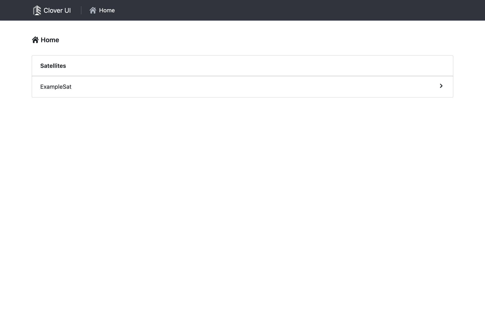

# クライアント実装例

Clover API のクライアント参考実装として、Clover UI を紹介します。

Clover UI はユーザーインタフェース（UI）を備える TypeScript 製の Web アプリケーションです。
Protocol Buffers と gRPC の TypeScript 実装として [Protobuf-ES](https://github.com/bufbuild/protobuf-es) と [Connect-ES](https://github.com/connectrpc/connect-es) を、Web アプリケーションフレームワークとして [Remix](https://remix.run/) を採用しています。

ソースコードは、GitHub リポジトリ [arkedge/clover-api](https://github.com/arkedge/clover-api) の [`client-ui` ディレクトリ](https://github.com/arkedge/clover-api/tree/main/client-ui)以下にあるので、クライアント実装の参考にしてください。

また、Clover UI の `linux/amd64` 向けコンテナイメージを GitHub Container registry より配布しています。

[https://github.com/arkedge/clover-api/pkgs/container/clover-ui](https://github.com/arkedge/clover-api/pkgs/container/clover-ui)

以下、こちらで配布しているコンテナイメージから Clover UI を起動する方法を説明します。

## Clover UI の起動

### Docker のインストール

コンテナの起動に Docker CLI を用いるため、Docker を利用できる Linux 環境を用意してください。

[https://docs.docker.com/engine/install/](https://docs.docker.com/engine/install/)

### Clover UI コンテナの起動

コンテナイメージから Clover UI を起動するには、以下の 3 つの環境変数を起動時に渡す必要があります。

- `CLOVER_BASE_URL`: HTTP over TLS プロトコルの Clover の URL
- `CLOVER_CLIENT_CERT`: クライアント TLS 証明書
- `CLOVER_KEY`: 証明書に対応する秘密鍵

[認証](authentication.md)の節で説明されているとおり、これらの値はクライアントの登録時にアークエッジ・スペースの担当者から送付されます。

ここでは、前節までと同様に以下を仮定することにします。

- ホスト名: `clover.example.com`
- TLS 証明書のパス: `./cert.pem`
- 秘密鍵のパス: `./secret.pem`

すると、次のコマンドで GitHub Container registry のコンテナイメージから Clover UI を起動できます。

```console
$ docker run \
  -e CLOVER_BASE_URL=https://clover.example.com \
  -e CLOVER_CLIENT_CERT="$(cat cert.pem)" \
  -e CLOVER_CLIENT_KEY="$(cat key.pem)" \
  -p 3000:3000 \
  ghcr.io/arkedge/clover-ui:latest
```

Clover UI はデフォルトで 3000 番ポートを使用するため、オプション `-p 3000:3000` でホスト側の 3000 番ポートからコンテナの 3000 番ポートにアクセスできるようにしています。

[http://localhost:3000](http://localhost:3000) にアクセスして、以下のような画面が表示されていれば Clover UI の起動は成功です。



[使い方](usage.md)の節で説明した機能はすべて実装されているので、ユーザインタフェースを操作しながら Clover の機能を確認してみてください。
